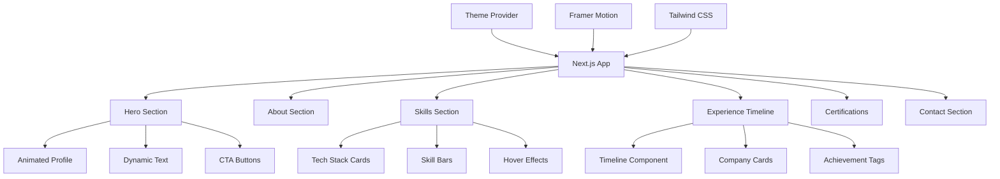

# Web Profile Design Plan for Akash Deep

## 🎯 Project Overview
Create a modern, eye-catching web profile showcasing Akash Deep's expertise as a Senior AI & Cloud Engineer with interactive animations, smooth transitions, and an engaging user experience.

## 🎨 Design Philosophy
- **Modern & Professional**: Clean, minimalist design with bold typography
- **Interactive & Engaging**: Smooth animations and micro-interactions
- **Tech-Forward**: Showcase AI/Cloud expertise through design elements
- **Performance-First**: Fast loading, optimized assets, smooth 60fps animations

## 📐 Architecture Overview



## 🎭 Key Features

### 1. Hero Section
- Large animated profile picture with gradient border
- Typing animation for role titles: "AI Engineer" → "Cloud Architect" → "Full Stack Developer"
- Floating particles background effect
- Smooth scroll indicator
- Quick action buttons: View Work, Download Resume, Contact

### 2. About Section
- Brief professional summary
- Key metrics counter animation (7+ years, 50+ projects, etc.)
- Animated skill tags cloud

### 3. Skills Section
**Generative AI Stack**
- LangChain, LangGraph, RAG, Vector DBs
- Interactive cards with flip animation on hover
- Progress indicators for proficiency

**Cloud & Infrastructure**
- AWS services with icon grid
- Animated on scroll reveal
- Hover tooltips with experience details

**Programming & Tools**
- Tech stack with animated logos
- Skill level indicators
- Category filters

### 4. Experience Timeline
- Vertical timeline with company logos
- Expandable cards for each role
- Achievement badges and highlights
- Smooth expand/collapse animations
- Color-coded by company

**Companies:**
1. IBM (Sep 2024 - Present) - Cloud Tech Lead
2. Novo Nordisk (Dec 2021 - Nov 2024) - Advanced IT Developer
3. Technumen (Mar 2021 - Dec 2021) - Senior Software Engineer
4. Infosys (Jan 2018 - Feb 2021) - Senior Systems Engineer

### 5. Certifications & Awards
- Badge-style display with icons
- Hover effects showing details
- Grid layout with stagger animation
- Categories: AWS, AI/ML, Agile, Awards

**Certifications:**
- AWS Certified Machine Learning – Specialty
- AWS Certified Developer – Associate
- LangChain & Generative AI Course
- InstructLab Certification
- Global Agile Developer

**Awards:**
- Leading with Brilliance Award (Novo Nordisk)
- Ace of Initiatives Award (Novo Nordisk)
- Insta Award for Automation Excellence (Infosys)

### 6. Contact Section
- Social links with hover animations
- Email with copy-to-clipboard
- Phone with click-to-call
- LinkedIn, GitHub links
- Download resume button
- Location: Bangalore, India

### 7. Theme Toggle
- Dark/Light mode switch
- Smooth color transitions
- Persistent preference (localStorage)
- System preference detection

## 🎨 Color Palette

### Light Theme
- Primary: `#3B82F6` (Blue)
- Secondary: `#8B5CF6` (Purple)
- Accent: `#10B981` (Green)
- Background: `#FFFFFF`
- Surface: `#F9FAFB`
- Text: `#111827`

### Dark Theme
- Primary: `#60A5FA` (Light Blue)
- Secondary: `#A78BFA` (Light Purple)
- Accent: `#34D399` (Light Green)
- Background: `#0F172A`
- Surface: `#1E293B`
- Text: `#F1F5F9`

## 🎬 Animation Strategy

### Page Load
1. Hero section fades in with scale effect
2. Profile picture slides in from left
3. Text types out character by character
4. CTA buttons fade in with stagger

### Scroll Animations
- Sections fade in and slide up when 20% visible
- Stagger animations for card grids
- Progress bars animate on scroll into view
- Timeline items reveal sequentially

### Hover Effects
- Cards lift with shadow increase
- Skill badges pulse and scale
- Buttons have gradient shift
- Links underline with slide animation

### Micro-interactions
- Smooth page scroll with easing
- Button ripple effects
- Icon rotations on hover
- Tooltip fade-ins

## 📱 Responsive Design

### Desktop (1280px+)
- Full-width hero with side-by-side layout
- 3-column skill grid
- Horizontal timeline option
- Large profile image

### Tablet (768px - 1279px)
- 2-column layouts
- Adjusted spacing
- Medium profile image
- Vertical timeline

### Mobile (< 768px)
- Single column layout
- Stacked sections
- Hamburger menu
- Smaller profile image
- Touch-optimized interactions

## 🚀 Performance Optimizations

1. **Image Optimization**
   - Next.js Image component for automatic optimization
   - WebP format with fallbacks
   - Lazy loading for below-fold images
   - Responsive image sizes

2. **Code Splitting**
   - Dynamic imports for heavy components
   - Route-based code splitting
   - Lazy load animations library

3. **Loading States**
   - Skeleton screens for content
   - Progressive image loading
   - Smooth transitions between states

4. **SEO & Accessibility**
   - Semantic HTML structure
   - ARIA labels for interactive elements
   - Alt text for all images
   - Keyboard navigation support
   - Focus indicators
   - Meta tags and Open Graph

## 📦 Technology Stack

- **Framework**: Next.js 14+ (App Router)
- **Language**: TypeScript
- **Styling**: Tailwind CSS
- **Animations**: Framer Motion
- **Icons**: Lucide React / React Icons
- **Fonts**: Inter (body), Space Grotesk (headings)
- **Deployment**: Vercel (recommended)

## 🗂️ Project Structure

```
my-web-profile/
├── app/
│   ├── layout.tsx
│   ├── page.tsx
│   ├── globals.css
│   └── favicon.ico
├── components/
│   ├── Hero.tsx
│   ├── About.tsx
│   ├── Skills.tsx
│   ├── Experience.tsx
│   ├── Certifications.tsx
│   ├── Contact.tsx
│   ├── ThemeToggle.tsx
│   └── ui/
│       ├── Button.tsx
│       ├── Card.tsx
│       └── Badge.tsx
├── lib/
│   ├── data.ts
│   └── utils.ts
├── public/
│   ├── profile.jpg
│   └── resume.pdf
├── doc/
│   ├── Akash_Deep_Resume.pdf
│   └── profile_picture.jpg
├── tailwind.config.ts
├── tsconfig.json
└── package.json
```

## 🎯 Success Metrics

1. **Visual Appeal**: Modern, professional design that stands out
2. **Engagement**: Interactive elements encourage exploration
3. **Performance**: Lighthouse score 90+ across all metrics
4. **Accessibility**: WCAG 2.1 AA compliance
5. **Responsiveness**: Perfect rendering on all device sizes
6. **Load Time**: First Contentful Paint < 1.5s

## 🔄 Implementation Flow

1. Set up Next.js with TypeScript and Tailwind
2. Create base layout and theme provider
3. Build components from top to bottom (Hero → Contact)
4. Add animations and interactions
5. Optimize performance and accessibility
6. Test across devices and browsers
7. Deploy to production

## 📝 Content Strategy

- Highlight AI/ML expertise prominently
- Showcase recent Generative AI work
- Emphasize leadership and impact
- Include quantifiable achievements
- Make resume easily downloadable
- Provide multiple contact methods

---

This design plan creates a portfolio that not only looks impressive but also tells your professional story in an engaging, interactive way. The focus on AI/Cloud technologies through design elements will immediately communicate your expertise to visitors.